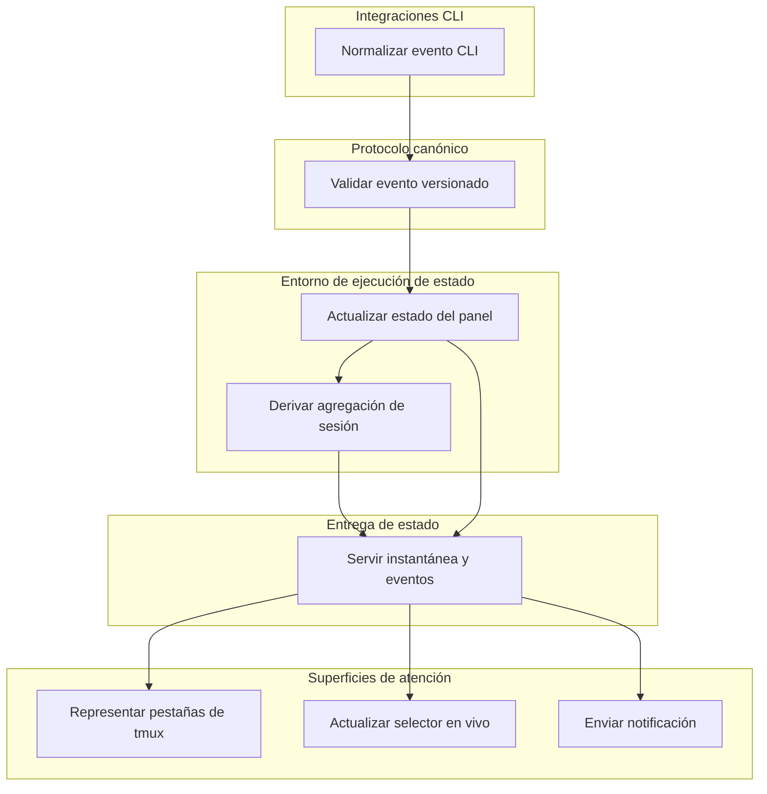

# Proporcionar atención independiente por panel en las superficies de tmux

## Propósito

Este documento explica por qué la pestaña de sesión actual de tmux muestra un solo color incluso cuando varios paneles tienen actividad de agentes, y define la arquitectura objetivo para conservar la atención independiente por panel en las pestañas, el selector y las notificaciones. Es la base arquitectónica para una fase posterior de SDD; no selecciona un lenguaje de implementación, transporte ni formato de paquete.

## Resumen ejecutivo

El comportamiento informado es real en el nivel de presentación, pero no se debe a que se seleccione el primer panel. El script de estado examina todos los paneles de una sesión y reduce sus estados a un único valor mediante esta prioridad:

`error > permission > waiting_for_input > blocked > done > running > idle`

Por lo tanto, la pestaña es una agregación en el nivel de sesión: su único color representa solamente el estado de panel con mayor prioridad y no puede exponer de forma independiente las atenciones de menor prioridad. Una reproducción enfocada con el panel 1 en `idle` y el panel 2 en `error` mostró la pestaña de error, lo que demuestra que el segundo panel participa. El selector actual ya representa una fila por cada panel capturado, pero su inventario de paneles y sus estados representados son una instantánea puntual tomada cuando se abre el selector. Las notificaciones de sonido actuales se inician mediante escrituras de panel y se deduplican con una clave de estado, sesión y panel; no se derivan de la agregación de sesión.

El objetivo es un modelo portable inspirado en Herdr:

1. Adaptadores CLI ligeros publican eventos de panel canónicos y versionados.
2. Un entorno de ejecución central valida los eventos, es propietario del estado y las revisiones, deriva las agregaciones de sesión y aplica la política de notificaciones.
3. Los consumidores se inicializan desde una instantánea y se suscriben a partir de su revisión.
4. Las pestañas de tmux muestran la agregación de sesión documentada, mientras que el selector en vivo expone cada panel y las notificaciones permanecen vinculadas al panel.

## Arquitectura actual

### Ruta de escritura del estado

| Responsabilidad | Evidencia actual |
| --- | --- |
| Resolver la identidad del panel | `resolve_session()` y `resolve_pane()` en [`scripts/agent-status.sh`](../scripts/agent-status.sh#L42-L93) usan el nombre de la sesión de tmux y `TMUX_PANE` o el ID del panel activo. |
| Normalizar el estado canónico | `normalize_state()` y `store_normalize()` aceptan `running`, `permission`, `waiting_for_input`, `blocked`, `done`, `idle` y `error`; los valores desconocidos se convierten en `blocked` ([`scripts/agent-status.sh`](../scripts/agent-status.sh#L95-L112), [`scripts/agent-status/store.sh`](../scripts/agent-status/store.sh#L9-L13)). |
| Persistir el estado del panel | `store_set()` escribe de forma atómica un registro v1 delimitado por tabulaciones en `panes/<session>_<pane>` y rechaza un ID de evento anterior al evento almacenado ([`scripts/agent-status/store.sh`](../scripts/agent-status/store.sh#L88-L107)). |
| Expirar el estado obsoleto | `store_effective()` aplica TTL separados para estados activos y terminales ([`scripts/agent-status/store.sh`](../scripts/agent-status/store.sh#L41-L57)); los valores predeterminados y sus redefiniciones se encuentran en [`scripts/agent-status/config.sh`](../scripts/agent-status/config.sh#L3-L29) y [`editors/tmux/agent-status.conf`](../editors/tmux/agent-status.conf). |
| Notificar | El comando `set` invoca `notify_transition()` después de cada escritura aceptada ([`scripts/agent-status.sh`](../scripts/agent-status.sh#L169-L179)). La clave del registro incluye el estado, la sesión saneada y el panel saneado ([`scripts/agent-status/notify.sh`](../scripts/agent-status/notify.sh#L40-L74)). |

La estructura del registro es:

```text
version<TAB>state<TAB>updated_at<TAB>source<TAB>event_id
```

La pertenencia al panel se representa mediante el nombre del archivo en lugar del registro. Los registros heredados en el nivel de sesión y los registros de una sola línea siguen siendo legibles, por lo que el protocolo de archivos ya constituye un límite de compatibilidad.

### Agregación de la pestaña de sesión

Las «pestañas» visuales del lado izquierdo de la barra de estado son sesiones de tmux, no ventanas de tmux. [`editors/tmux/tmux.conf`](../editors/tmux/tmux.conf#L101-L123) ejecuta `status-sessions.sh` en `status-left` cada cinco segundos; la etiqueta nativa de la ventana centrada se configura por separado.

`status-sessions.sh` toma una instantánea mediante una única ejecución de `tmux list-panes -a` y la pasa al proceso de representación ([`scripts/status-sessions.sh`](../scripts/status-sessions.sh#L95-L105)). Para cada sesión, `session_status()`:

1. Recorre cada fila de la instantánea correspondiente a esa sesión.
2. Carga el registro efectivo de ese panel.
3. Asigna el estado a una prioridad numérica.
4. Conserva el estado únicamente cuando su prioridad es mayor que la mejor prioridad actual.

La implementación se encuentra en [`session_status()`](../scripts/status-sessions.sh#L45-L55). `aggregate_session_state()` en [`scripts/agent-status.sh`](../scripts/agent-status.sh#L102-L135) utiliza la misma regla de prioridad para `get` y `summary`.

Esto demuestra dos hechos distintos:

- No existe una selección del primer panel en el algoritmo actual de la pestaña. Se considera cada panel de la instantánea.
- Aun así, una pestaña solo tiene un espacio para el estado. El panel con mayor prioridad oculta todos los estados de paneles con menor prioridad, lo que genera la impresión de que solo importa un panel.

Los paneles con la misma prioridad producen la misma agregación, por lo que el orden que tengan en la instantánea no produce ningún efecto visible. El orden de los paneles solo es relevante para la identidad y el orden del selector, no para la precedencia de estados.

### Representación del selector

La ruta normal del selector captura una instantánea masiva de los paneles antes de crear el panel flotante ([`scripts/session-picker-wrapper.sh`](../scripts/session-picker-wrapper.sh#L103-L132)). La instantánea se mantiene estable de forma intencionada mientras se ejecuta el selector.

Cuando el cuarto campo contiene un ID de panel, `picker_rows()` en [`scripts/session-picker.sh`](../scripts/session-picker.sh#L194-L243):

- emite un encabezado de sesión;
- emite una fila seleccionable por cada panel capturado;
- lee de forma independiente el estado efectivo de cada panel mediante `pane_state()`;
- permite cambiar directamente al panel seleccionado.

Esto es una representación independiente de paneles, no una agregación de sesión. Sin embargo, `fzf` recibe las filas una sola vez mediante la entrada estándar. La creación y eliminación de paneles, los cambios de identidad de herramientas y las transiciones de estado posteriores al inicio no actualizan el selector abierto. La rama de entrada heredada continúa orientada a la sesión ([`scripts/session-picker.sh`](../scripts/session-picker.sh#L245-L405)).

### Alcance de las notificaciones

Los adaptadores integrados actuales resuelven un panel de tmux antes de escribir. `notify_transition()` recibe ese panel directamente y usa `state|session|pane` como clave de su período de espera. Por lo tanto, las notificaciones están vinculadas al panel, no a la agregación de sesión.

Existen dos salvedades:

- La política de notificaciones se ejecuta después de cada escritura aceptada, incluso cuando el estado efectivo no cambió. El período de espera suprime sonidos repetidos, pero actualmente el almacén no demuestra que haya ocurrido una transición real.
- Codex también conserva su notificador externo de finalización preexistente después de registrar `done` ([`scripts/codex-agent-status.sh`](../scripts/codex-agent-status.sh#L29-L37)). Esa ruta de notificación externa es independiente del registro de sonidos compartido.

### Limitaciones verificadas

| Limitación | Consecuencia | Evidencia |
| --- | --- | --- |
| Un valor escalar por pestaña de sesión | La atención de paneles con menor prioridad no es visible en la pestaña. | `session_status()` en [`scripts/status-sessions.sh`](../scripts/status-sessions.sh#L45-L55). |
| Barra de estado por sondeo | La actualización de la pestaña está limitada por el intervalo de cinco segundos de tmux, no por la entrega de eventos. | [`editors/tmux/tmux.conf`](../editors/tmux/tmux.conf#L104-L112). |
| Selector puntual | El selector abierto no puede reaccionar a cambios posteriores en los paneles o los estados. | Creación de la instantánea en [`scripts/session-picker-wrapper.sh`](../scripts/session-picker-wrapper.sh#L103-L120) y la única canalización de `fzf` en [`scripts/session-picker.sh`](../scripts/session-picker.sh#L194-L243). |
| Identidad mutable en los nombres de archivo | Renombrar una sesión de tmux cambia la clave de búsqueda y puede dejar huérfano un estado de panel que, de otro modo, sería válido. La reutilización del ID de panel también puede asociar un registro obsoleto hasta que intervengan las comprobaciones del origen, la lógica de limpieza o la recuperación mediante TTL. | `pane_file()` en [`scripts/agent-status.sh`](../scripts/agent-status.sh#L50-L64) y `store_path()` en [`scripts/agent-status/store.sh`](../scripts/agent-status/store.sh#L26-L29). |
| Ausencia de una revisión central | Los consumidores no pueden solicitar «cambios posteriores a la instantánea N» ni detectar una interrupción en los eventos. | El registro v1 actual en `store_set()` tiene ID de eventos por escritor, pero no una revisión global ([`scripts/agent-status/store.sh`](../scripts/agent-status/store.sh#L88-L107)). |
| Política distribuida | La mutación del estado, la expiración, la agregación, la inferencia del origen y las reglas de notificación están distribuidas entre scripts de shell y adaptadores. | [`scripts/agent-status.sh`](../scripts/agent-status.sh), [`scripts/status-sessions.sh`](../scripts/status-sessions.sh), [`scripts/codex-status-refresh.sh`](../scripts/codex-status-refresh.sh) y [`scripts/agent-status/notify.sh`](../scripts/agent-status/notify.sh). |
| Observación de Codex impulsada por la representación | Los estados de ejecución y atención de Codex solo se actualizan cuando una representación de estado invoca el clasificador acotado de pantalla. | [`scripts/status-sessions.sh`](../scripts/status-sessions.sh#L95-L98) y [`scripts/codex-status-refresh.sh`](../scripts/codex-status-refresh.sh#L71-L101). |

Existe cobertura específica en [`test/scripts/agent-status-protocol.sh`](../test/scripts/agent-status-protocol.sh): la prioridad y los conteos de la agregación se comprueban en torno a `aggregate state counts`, la jerarquía de paneles en torno a `Picker consumes one bulk snapshot` y el período de espera del sonido basado en paneles en torno a `Sound is opt-in`. [`test/scripts/tmux-codex-popup.sh`](../test/scripts/tmux-codex-popup.sh) cubre la clasificación conservadora de Codex y la limpieza de la caché.

## Arquitectura objetivo

El diagrama respalda una decisión: la propiedad del estado y la política de notificaciones pasan a un entorno de ejecución central, mientras que los adaptadores y las superficies de interfaz permanecen ligeros. Comience en **Normalizar evento CLI** y lea hacia abajo.



### Responsabilidades de las capas

| Capa | Es responsable de | No debe ser responsable de |
| --- | --- | --- |
| Adaptadores CLI ligeros | Traducir los hooks nativos disponibles en eventos canónicos, declarar capacidades y adjuntar una identidad local estable del proceso y de tmux. | La prioridad de agregación, el formato de la interfaz, el período de espera de las notificaciones o la persistencia compartida. |
| Protocolo canónico versionado | Los esquemas de eventos e instantáneas, el vocabulario de estados, los campos de identidad, las declaraciones de capacidades, la semántica de las revisiones y las reglas de validación. | El comportamiento específico del transporte o los nombres de eventos específicos de una CLI. |
| Entorno de ejecución central/intermediario de estado | El estado más reciente de los paneles, la expiración, el arbitraje de orígenes, las revisiones monotónicas, las agregaciones de sesión, las suscripciones y la política de transición de notificaciones. | Los estilos de tmux o la representación de `fzf`. |
| API de entrega | Una instantánea atómica en la revisión `R`, eventos ordenados posteriores a `R` y señalización de reconexiones e interrupciones. | La reconstrucción independiente del estado en cada consumidor. |
| Consumidores | Las pestañas representan agregaciones; el selector representa el inventario y el estado de los paneles; el notificador utiliza los canales locales aprobados. | La mutación del estado canónico o la invención de estados de productor no admitidos. |

Aquí no se selecciona ningún lenguaje de implementación, supervisor de procesos persistentes, transporte IPC ni paquete de distribución. Esas elecciones requieren evidencias de prototipos de portabilidad y pertenecen a la fase posterior de SDD.

## Ejemplo de flujo de eventos

Para un panel de OpenCode que cambia de `running` a `done`:

1. El adaptador de OpenCode asigna su evento nativo de inactividad o finalización a un evento canónico `done` con la capacidad del productor, la identidad del proceso, la identidad del panel de tmux y la secuencia del productor.
2. El límite del protocolo rechaza versiones, estados, identidades o secuencias con formato incorrecto antes de que alcancen el estado compartido.
3. El entorno de ejecución compara el evento con el propietario actual y el registro del panel, acepta la transición y asigna la revisión global `R+1`.
4. El registro del panel pasa a ser `done`. El entorno de ejecución vuelve a calcular la agregación de su sesión mediante la prioridad documentada sin modificar los registros de los paneles hermanos.
5. Los suscriptores reciben la actualización del panel y, solo si cambió, la agregación de sesión derivada en la revisión `R+1`.
6. El consumidor de pestañas de tmux representa la agregación. El selector actualiza en el mismo lugar la fila del panel correspondiente y conserva todas las filas hermanas.
7. La política de notificaciones evalúa la transición de panel `running -> done` y después emite, como máximo, una notificación para ese panel, revisión de transición y canal.

La notificación no depende de que `done` prevalezca en la agregación de sesión. Por ejemplo, un panel hermano en `error` mantiene la pestaña roja mientras el panel que finalizó continúa recibiendo su propia notificación de finalización deduplicada y permanece visible como `done` en el selector.

## Semántica de múltiples paneles

### Estado del panel

- Cada panel de tmux posee un estado canónico y una identidad de productor independientes.
- Una transición de panel no debe sobrescribir, borrar ni confirmar un panel hermano.
- Un panel sin estado de productor admitido está en `idle` o explícitamente en `unknown`; no debe heredar la agregación de sesión.
- Si varios agentes admitidos comparten un panel, la propiedad del origen y su transferencia siguen una regla de arbitraje del entorno de ejecución en lugar de la antigüedad del nombre de archivo o heurísticas de presentación.

### Agregación de sesión y pestaña

El estado de sesión/pestaña se deriva, nunca lo escribe un adaptador. Es el estado máximo entre los paneles activos según esta prioridad estable:

| Prioridad | Estado | Significado para la pestaña |
| ---: | --- | --- |
| 70 | `error` | Un panel falló y necesita atención. |
| 60 | `permission` | Un panel necesita una decisión de aprobación. |
| 50 | `waiting_for_input` | Un panel necesita una respuesta o selección. |
| 40 | `blocked` | Un panel necesita una acción humana que no puede clasificarse con mayor precisión. |
| 30 | `done` | Un panel terminó y necesita revisión. |
| 20 | `running` | Al menos un panel está trabajando activamente. |
| 10 | `idle` | Ningún panel necesita atención ni informa actividad en este momento. |

Los conteos por estado siguen disponibles aunque la pestaña compacta muestre un solo estado predominante. Esto permite que las presentaciones futuras de las pestañas añadan un conteo o marcador sin cambiar la semántica canónica.

### Notificaciones y selector

- La elegibilidad para notificaciones se evalúa por cada transición de panel aceptada, no por agregación de sesión ni por cada señal de actividad repetida.
- La deduplicación debe sobrevivir a la reconexión y la reproducción. La identidad semántica es la revisión de transición del panel más el canal de notificación; una política configurable puede, además, combinar transiciones rápidas.
- La instantánea del selector contiene todas las sesiones, ventanas y paneles visibles de tmux, incluidos los paneles en `idle`.
- Los eventos de suscripción añaden, actualizan, mueven o eliminan filas de paneles mientras el selector está abierto.
- Seleccionar una sesión sigue siendo válido; seleccionar un panel apunta exactamente a ese panel.

## Modelo de instantáneas, suscripciones y revisiones

El entorno de ejecución expone dos operaciones complementarias:

```text
snapshot() -> { protocol_version, revision, sessions[], panes[] }
subscribe(after_revision) -> ordered state and inventory events
```

La secuencia de inicialización del cliente es:

1. Conectarse y solicitar una instantánea atómica en la revisión `R`.
2. Representar la instantánea.
3. Suscribirse a los eventos estrictamente posteriores a `R`.
4. Aplicar los eventos en orden de revisión y registrar la última revisión aplicada.

Al desconectarse, el cliente conserva su última vista representada, pero la marca como obsoleta cuando corresponde. Al reconectarse, solicita reanudar después de su última revisión. Si el entorno de ejecución conservó el intervalo completo, la reproducción cierra la interrupción. Si la revisión es desconocida, expiró o pertenece a una época anterior del entorno de ejecución, el servidor devuelve una señal de interrupción y el cliente sustituye el estado local por una instantánea nueva. Los consumidores nunca combinan una instantánea obsoleta sin límites con un flujo de eventos nuevo.

Las señales de actividad actualizan la vigencia sin crear transiciones visibles para el usuario ni notificaciones duplicadas. La eliminación de paneles, el cambio de nombre de sesiones y la expiración del entorno de ejecución son eventos canónicos explícitos, por lo que los cambios de identidad no dependen de nombres de archivos de caché.

## Capacidades y degradación de los adaptadores

Los adaptadores declaran qué pueden observar. El entorno de ejecución no debe inferir una precisión no admitida a partir de la presencia de un productor.

| Adaptador | Señales actuales | Carencias actuales | Degradación objetivo |
| --- | --- | --- | --- |
| OpenCode | Hooks de eventos para los comportamientos `running`, `blocked`, `done`, `error` e `idle`; origen e ID de eventos monotónicos locales al proceso; señal de actividad activa ([`editors/opencode/plugins/tmux-agent-status.ts`](../editors/opencode/plugins/tmux-agent-status.ts)). | Las variantes de permiso y pregunta se reducen a `blocked`; el adaptador agrega sesiones hijas de OpenCode dentro de un panel de tmux. | Declarar capacidad de ciclo de vida completo más atención aproximada; conservar la agregación de elementos hijos local al panel hasta que se defina la semántica canónica de los subagentes. |
| Claude Code | Los hooks asignan la actividad de prompts/herramientas a `running`, permisos/notificaciones a `blocked`, fallos a `error`, detenciones a `done` y el fin de sesión a una limpieza ([`scripts/claude-agent-status.sh`](../scripts/claude-agent-status.sh), [`editors/claude/settings.json`](../editors/claude/settings.json)). | Sin señal de actividad; los ID de eventos en segundos desde la época pueden coincidir; sin distinción precisa entre permiso y estado de bloqueo general. | Declarar un ciclo de vida basado en eventos sin señal de actividad y una capacidad de atención aproximada; la recuperación mediante TTL permanece activa. |
| Pi | Un ciclo de vida completo y la interceptación de la interfaz se asignan a `running`, `blocked`, `done`, `error`, `idle` y limpieza ([`editors/pi/agent/extensions/tmux-agent-status.ts`](../editors/pi/agent/extensions/tmux-agent-status.ts)). | Invoca la CLI sin origen ni ID de evento, por lo que los registros usan `unknown` y la secuencia `0`; sin señal de actividad. | Añadir la identidad y la secuencia del productor cuando se admitan; de lo contrario, aceptar la entrega local ordenada con una capacidad explícita de ordenamiento reducido. |
| Codex | La notificación de finalización informa `done`; la observación acotada de procesos y pantalla informa `running`, `permission`, espera, `idle` y limpieza ([`scripts/codex-agent-status.sh`](../scripts/codex-agent-status.sh), [`scripts/codex-status-refresh.sh`](../scripts/codex-status-refresh.sh)). | No hay un hook autoritativo para el ciclo de vida completo en la integración desplegada; actualmente, la observación depende de la representación del estado y no puede informar errores de forma fiable. | Declarar capacidad únicamente de finalización para los hooks y capacidad de observación para el clasificador. Nunca elevar solo la presencia de un proceso por encima de `idle`; mantener visible para el entorno de ejecución la confianza del clasificador. |

Los niveles de capacidad deben distinguir entre eventos autoritativos, observaciones inferidas, productores que solo informan finalización, soporte de señales de actividad y soporte de `clear`/eliminación. Los estados no admitidos se degradan al estado canónico honesto más cercano, normalmente `blocked` para la atención humana conocida o `idle`/`unknown` cuando no se puede demostrar actividad.

## Límites operativos

### Módulos

Los módulos lógicos objetivo son las definiciones del protocolo, el SDK del adaptador o intermediario CLI, el entorno de ejecución de estado, el puente de inventario de tmux, el presentador de pestañas, el presentador del selector en vivo, el servicio de notificaciones, el cargador de configuración y el comando doctor. Los límites lógicos no implican paquetes ni procesos separados.

### Portabilidad e instalación

- Admitir macOS y Linux sin integrar rutas de Homebrew, archivos de sonido de macOS ni un gestor de servicios específico en el protocolo.
- Seguir los directorios de estado y ejecución de XDG cuando estén disponibles, con alternativas seguras explícitas.
- Instalar únicamente los adaptadores de las CLI detectadas; la ausencia de integraciones no debe hacer que fallen el entorno de ejecución ni las superficies de tmux.
- Conservar la propiedad de los enlaces simbólicos de dotly. Las asignaciones actuales de macOS se encuentran en [`symlinks/conf.macos.yaml`](../symlinks/conf.macos.yaml#L11-L22); actualmente, Linux no tiene asignaciones de integración de agentes en [`symlinks/conf.linux.yaml`](../symlinks/conf.linux.yaml).
- Mantener la configuración activa de Codex gestionada por la máquina y fuera de dotly, como documenta [`editors/codex/config.reference.toml`](../editors/codex/config.reference.toml#L1-L10).

### Configuración y doctor

La configuración permanece versionada y se valida antes del inicio. Debe cubrir los TTL, la prioridad de agregación, los estados de notificación y el período de espera, los adaptadores habilitados, el punto de conexión del entorno de ejecución y los sistemas de notificación de la plataforma sin mezclar los colores de presentación con la semántica del protocolo.

El comando doctor debe informar la versión del protocolo y la configuración, la disponibilidad del entorno de ejecución, su época y revisión más reciente, los permisos de las rutas de estado, la conectividad con tmux, la instalación y las capacidades declaradas de los adaptadores, la disponibilidad del sistema de notificación, los conteos de estados obsoletos/huérfanos y el retraso de los suscriptores. Las comprobaciones deben ser de solo lectura y no deben invocar los sistemas de notificación.

### Recuperación ante fallos

- Los adaptadores fallan de forma abierta: la imposibilidad de informar la atención nunca bloquea ni cierra de forma inesperada la CLI.
- Los eventos no válidos o fuera de orden se rechazan con diagnósticos acotados y nunca corrompen el último estado de panel aceptado.
- El reinicio del entorno de ejecución crea una nueva época; los clientes reproducen dentro de esa época o sustituyen el estado a partir de una instantánea.
- Los TTL recuperan los estados activos abandonados. La retención y confirmación de estados terminales siguen siendo una política, no un comportamiento del adaptador.
- La reconciliación del inventario de tmux emite eventos de eliminación y cambio de nombre de paneles/sesiones y limpia el estado huérfano sin esperar una representación del estado.
- Un fallo en la entrega de notificaciones no revierte el estado canónico; los reintentos y la deduplicación usan la identidad de la transición.
- Un selector que se cerró de forma inesperada puede volver a conectarse desde una instantánea sin afectar al entorno de ejecución ni a los adaptadores.

### Seguridad

- Mantener el transporte local de forma predeterminada y restringir su punto de conexión en el sistema de archivos al usuario actual.
- Validar la versión del protocolo, la enumeración de estados, los identificadores acotados, los valores de secuencia y el tamaño de la carga útil antes de persistirlos o difundirlos.
- Transportar únicamente metadatos semánticos. El texto de los prompts, los argumentos de herramientas, el contenido de la pantalla del terminal, los secretos y las respuestas del modelo no pertenecen a los eventos canónicos.
- Tratar la clasificación observacional de la pantalla como una responsabilidad del adaptador local; no publicar el contenido capturado del terminal.
- Los sistemas de notificación permanecen en una lista de permitidos y reciben límites de argumentos fijos. Los productores no pueden enviar comandos ejecutables ni rutas de sonido arbitrarias.
- Los consumidores son de solo lectura, excepto por los comandos explícitos de confirmación definidos por el protocolo.

### Fuera de alcance

- Sustituir tmux, fzf o la API nativa de ciclo de vida de cada CLI.
- Sincronizar el estado de atención entre máquinas o usuarios.
- Persistir el contenido de conversaciones o reconstruir historiales completos de agentes.
- Garantizar una precisión de estado idéntica para CLI con diferentes capacidades de eventos.
- Seleccionar en este documento un lenguaje para el entorno de ejecución, transporte, gestor de servicios o estructura de paquetes.
- Cambiar el código del entorno de ejecución durante esta base arquitectónica.

## Migración sin afectar a los usuarios existentes

1. Inmovilizar y probar el contrato de archivos v1. Mantener el comportamiento de `agent-status.sh set|get|summary|clear|inspect|snapshot|doctor` y el análisis actual de la caché como base de compatibilidad.
2. Definir los esquemas versionados de eventos, instantáneas, capacidades, identidad, época y revisión de forma independiente del transporte.
3. Introducir el entorno de ejecución con un puente de compatibilidad v1 que importe los archivos de panel actuales y exponga instantáneas canónicas. Los adaptadores existentes y la representación de tmux continúan funcionando.
4. Convertir la CLI actual en un intermediario capaz de publicar en el entorno de ejecución y conservar una alternativa protegida basada en archivos v1. Las invocaciones de adaptadores antiguos siguen siendo válidas.
5. Trasladar la política de transición de notificaciones al entorno de ejecución. Durante la transición, solo se habilita un propietario de las notificaciones y doctor informa la propiedad duplicada.
6. Cambiar el presentador de pestañas a las instantáneas y suscripciones del entorno de ejecución, conservando la prioridad y los colores actuales.
7. Cambiar el selector a una inicialización mediante instantánea más suscripciones en vivo; conservar la ruta puntual como alternativa temporal cuando el entorno de ejecución no esté disponible.
8. Migrar los adaptadores individualmente según su capacidad. La observación de Codex se retira de la ruta de representación únicamente después de que exista un activador equivalente y acotado del inventario.
9. Eliminar las escrituras directas en archivos únicamente después de que todos los adaptadores, presentadores, asignaciones de restauración y comprobaciones de doctor instalados confirmen la propiedad del entorno de ejecución. Seguir leyendo archivos v1 durante un período de compatibilidad documentado porque ya existen estados persistidos e invocaciones externas.

Cada paso es reversible de forma independiente en el límite del consumidor o del adaptador. Ningún paso de la migración exige cambiar al mismo tiempo todas las CLI ni ambos sistemas operativos.

## Decisiones abiertas para la fase posterior de SDD

| Decisión | Evidencia necesaria antes de elegir |
| --- | --- |
| Lenguaje de implementación del entorno de ejecución | Costo de inicio, memoria residente, entornos de ejecución disponibles en macOS/Linux, seguridad de la concurrencia y mantenibilidad en este repositorio. |
| Transporte local | Semántica de instantáneas/suscripciones, comportamiento de reconexión, permisos, contrapresión, compatibilidad con clientes de tmux/fzf y capacidad de prueba. |
| Ciclo de vida de los procesos y empaquetado | Modelo de restauración de dotly, disponibilidad de launchd/systemd, alternativa en primer plano, comportamiento de actualización y limpieza de la desinstalación. |
| Identidad estable del panel | Comportamiento ante el cambio de nombre de una sesión de tmux, la reutilización del ID del panel, el reinicio del servidor, el movimiento del panel y múltiples servidores de tmux. |
| Persistencia del estado y retención de revisiones | Continuidad necesaria tras el reinicio, ventana de reproducción, límites de disco, comportamiento de las épocas y semántica de confirmación terminal. |
| Múltiples productores en un panel | Transferencia de propiedad, precedencia de confianza, representación de subagentes, expulsión de orígenes obsoletos y diagnósticos de conflictos. |
| Canales de notificación y confirmación | Compatibilidad con sonido frente a notificaciones de escritorio, política de transiciones, período de espera/combinación, supresión por foco y listas portables de sistemas permitidos. |
| Propiedad y esquema de la configuración | Separación de los valores del protocolo, entorno de ejecución, presentación, adaptador y máquina local; migración desde `AGENT_STATUS_CONFIG_VERSION=1`. |
| Alcance de la integración con Linux | Carencias en los enlaces simbólicos/instalación, disponibilidad del sistema de notificación, supervisión del entorno de ejecución y comportamiento del terminal en un equipo Linux real. |

Estos son puntos de decisión intencionados, no detalles de implementación ausentes. El trabajo posterior de SDD debe resolverlos mediante prototipos y evidencia operativa en lugar de tratar la estructura actual en Bash o la implementación de Herdr como una elección tecnológica automática.
